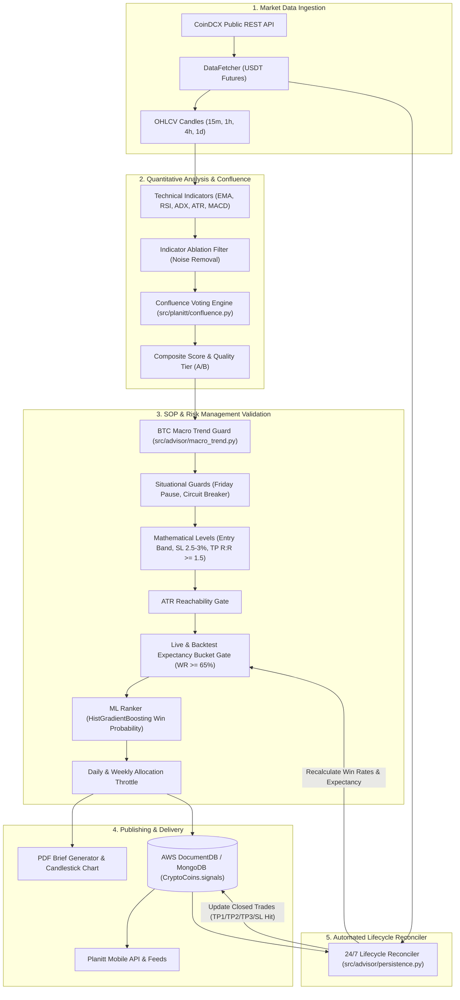

# CoinDCX Futures Advisor & 24/7 Quantitative Signal Engine

[](https://www.python.org/)
[](https://fastapi.tiangolo.com/)
[](https://www.docker.com/)
[](https://aws.amazon.com/ecs/)
[-47A248?logo=mongodb&logoColor=white)](https://aws.amazon.com/documentdb/)
[](https://scikit-learn.org/)
[](https://pytest.org/)
[](LICENSE)

An institutional-grade cryptocurrency futures quantitative research platform and 24/7 automated signal generation engine designed specifically for **CoinDCX** (USDT futures).

The engine executes continuous multi-timeframe universe scans, computes high-confluence technical indicator scores, enforces strict **Standard Operating Procedure (SOP)** risk management formulas, gates signals based on real historical win rates, renders publication-ready PDF briefs with technical charts, and autonomously tracks trade lifecycles (TP/SL hits) 24/7 in the cloud.

> [!IMPORTANT]
> **Educational & Quantitative Research Disclaimer:**  
> This software is strictly for quantitative research, backtesting, and educational purposes. It does not constitute financial, investment, or trading advice. Trading cryptocurrency futures and leveraged derivatives involves substantial risk of capital loss. Always perform your own due diligence.

---

## Table of Contents

- [Overview & Core Value](#overview--core-value)
- [Key Features](#key-features)
- [System Architecture](#system-architecture)
- [Quantitative Signal Pipeline & SOP Gates](#quantitative-signal-pipeline--sop-gates)
  - [1. Multi-Indicator Confluence Voting](#1-multi-indicator-confluence-voting)
  - [2. Mathematical Target & Risk Calculations](#2-mathematical-target--risk-calculations)
  - [3. Macro Trend & Situational Guards](#3-macro-trend--situational-guards)
  - [4. Expectancy & Win-Rate Gating (65% Profile)](#4-expectancy--win-rate-gating-65-profile)
  - [5. Machine Learning Candidate Ranker](#5-machine-learning-candidate-ranker)
- [Quick Start: Local Development](#quick-start-local-development)
  - [Prerequisites](#prerequisites)
  - [Step 1: Clone & Virtual Environment](#step-1-clone--virtual-environment)
  - [Step 2: Environment Configuration](#step-2-environment-configuration)
  - [Step 3: Run the Server & Background Workers](#step-3-run-the-server--background-workers)
  - [Step 4: Execute a Manual Universe Scan](#step-4-execute-a-manual-universe-scan)
- [Docker 24/7 Local Deployment](#docker-247-local-deployment)
- [AWS Cloud 24/7 Production Deployment (ECS Fargate)](#aws-cloud-247-production-deployment-ecs-fargate)
- [REST API Reference](#rest-api-reference)
  - [Interactive Documentation](#interactive-documentation)
  - [Endpoints Overview](#endpoints-overview)
  - [Sample Requests & Responses](#sample-requests--responses)
- [Configuration Reference](#configuration-reference)
- [Repository Structure](#repository-structure)
- [Research, Backtesting & ML Tooling](#research-backtesting--ml-tooling)
- [Testing & Quality Assurance](#testing--quality-assurance)
- [Troubleshooting & FAQ](#troubleshooting--faq)
- [Contributing](#contributing)
- [License](#license)

---

## Overview & Core Value

Traditional crypto signal bots often generate erratic calls, lack multi-timeframe discipline, ignore broader market regime conditions, or fail due to unstructured risk management. 

**CoinDCX Futures Advisor** was engineered from the ground up to solve these problems by acting as an institutional risk gatekeeper:

1. **Disciplined Risk Math:** Signals never rely on arbitrary stop-loss levels. Unleveraged stop losses are mathematically bounded between **2.5% and 3.0%**, and leverage is dynamically computed to guarantee that total leveraged risk is strictly capped between **18% and 22%**.
2. **Quality Over Quantity:** Rather than over-trading choppy sideways markets, the engine enforces strict daily and weekly quota limits (e.g. 8 daily, 35 weekly; or 4 daily, 21 weekly in high-accuracy mode) and pauses signals during weekend chop or after consecutive losses.
3. **Automated Lifecycle Reconciliation:** Trades are not forgotten once published. An asynchronous background reconciler monitors live CoinDCX candle ticks 24/7, detects when Take Profit (TP1/TP2/TP3) or Stop Loss (SL) targets are reached, updates the database, and recalibrates win rates in real-time.
4. **Institutional Reporting:** Every validated trade generates a publication-ready PDF brief containing technical charts, entry/target tables, indicator confluence breakdown, and optional local LLM commentary (Ollama / Plutus).

---

## Key Features

- **24/7 Automated Universe Scanner:** Continuously inspects top CoinDCX perpetual contracts (BTC, ETH, SOL, BNB, XRP, ADA, AVAX, DOGE, LINK, DOT, NEAR, UNI, and more) across `15m`, `1h`, `4h`, and `1d` intervals.
- **Unified Multi-Indicator Confluence:** Synthesizes signals across Trend (EMA, Supertrend), Momentum (RSI, MACD, ADX), Volatility (ATR), and Smart Money Concepts (SMC order blocks). Requires $\ge 4$ independent indicator families to agree.
- **65% Accuracy Optimization & Indicator Ablation:** Removes low-edge, noisy indicators (e.g., CCI, Williams %R, Stochastic, Bollinger) to achieve $\ge 65\%$ closed-trade win-rate expectancy on major pairs.
- **Bitcoin Macro Trend Guard:** Altcoin SELL signals are blocked unless Bitcoin confirms a 4h bearish regime, preventing disastrous shorting into macro bull expansions.
- **Situational Risk Protection:**
  - **Friday / Weekend Slowdown:** Automatically pauses publishing from Friday evening through Sunday to protect capital from low-liquidity weekend manipulation.
  - **Consecutive Loss Circuit Breaker:** Pauses new signals for 6 hours if 2 consecutive stop-outs occur in recent trades.
- **SOP-Safe Machine Learning Ranker:** Employs `HistGradientBoosting` models to score trade win probability and rank publish candidates without ever overriding core risk boundaries.
- **Multi-Service Architecture:** Run locally in Python, within an isolated Docker Compose network (`coindcx-advisor`), or completely serverless on **AWS ECS Fargate** paired with **AWS DocumentDB**.

---

## System Architecture

The platform operates as an asynchronous, event-driven architecture decoupling market data ingestion, quantitative scoring, SOP risk gating, database persistence, and lifecycle reconciliation:



---

## Quantitative Signal Pipeline & SOP Gates

Every candidate trade must pass through five consecutive validation gates before being approved for publication:

### 1. Multi-Indicator Confluence Voting
Candidate trades are analyzed across multiple technical indicator families:
- **Trend:** Exponential Moving Averages (EMA 9, 21, 50, 200), Supertrend.
- **Momentum:** RSI (14) with zone filtering, MACD histogram momentum, ADX trend strength.
- **Structure:** Smart Money Concepts (SMC) order blocks and Fair Value Gaps (FVG).
- **Minimum Criteria:**
  - Confidence Score: $\ge 0.76$
  - Composite Score: $\ge 0.80$ (Tier A: $\ge 0.88$, Tier B: $\ge 0.78$)
  - Multi-Timeframe (MTF) Alignment: $\ge 0.55$
  - Agreeing Indicator Families: $\ge 4$ independent sources.

### 2. Mathematical Target & Risk Calculations
Trading levels are computed using strict mathematical SOP rules rather than subjective visual guesses:

$$\text{Stop Loss (SL Distance)} \in [2.5\%,\, 3.0\%]$$

$$\text{Recommended Leverage} = \text{clamp}\left(\left\lfloor \frac{20.0}{\text{SL}_{\%}} \right\rfloor,\, 2,\, 20\right)$$

$$\text{Leveraged Risk} = \text{SL}_{\%} \times \text{Leverage} \in [18.0\%,\, 22.0\%]$$

- **Entry Band:** Defined as a tight band ($0.5\%$ to $1.5\%$ width) around the current price. Live market price must be within the band at publish time.
- **Take Profit (TP) Levels:**
  - **Target 1:** $1.0\times$ Risk (R:R $= 1.0$)
  - **Target 2:** $1.5\times$ Risk (R:R $= 1.5$ to $1.8$, primary profit target)
  - **Target 3:** $1.8\times - 2.0\times$ Risk (runner / extended trend target)

### 3. Macro Trend & Situational Guards
- **Bitcoin Macro Alignment:** Altcoin SELL signals are rejected unless Bitcoin ($4\text{h}$) is in a confirmed downtrend (`btc_macro_bear_4h`), avoiding false counter-trend shorts.
- **ADX Choppiness Filter:** Requires $\text{ADX} \ge 14 - 20$ depending on timeframe to prevent trading in dead, sideways volatility.
- **Friday & Weekend Slowdown:** Automatically halts signal issuance from Friday 22:00 IST through Sunday night to protect against weekend wash trading and thin books.
- **Consecutive Loss Pause:** If 2 consecutive signals hit stop-loss within the recent lookback window, new signal generation is halted for 6 hours.

### 4. Expectancy & Win-Rate Gating (65% Profile)
Historical performance is tracked by discrete buckets:

$$\text{Bucket Key} = \text{symbol}\_\text{direction}\_\text{timeframe} \quad (\text{e.g., } \texttt{BTC\_BUY\_1h})$$

- If a bucket's live historical win rate falls below the configured threshold ($\ge 65\%$ in high-accuracy mode, $\ge 50\%$ standard), or if backtest expectancy is negative, signals in that bucket are automatically blocked.

### 5. Machine Learning Candidate Ranker
- A trained `HistGradientBoostingClassifier` evaluates normalized feature vectors (RSI, ADX, ATR ratio, MTF alignment score, indicator agreement counts).
- Ranks candidate signals to prioritize highest-probability setups.
- **SOP-Safe Guarantee:** The ML model can only rank or apply soft filtering—it is mathematically incapable of altering entry, SL, TP, or leverage bounds.

---

## Quick Start: Local Development

### Prerequisites

- **Python 3.11+ or 3.12** (macOS: `brew install python@3.12`, Linux: `apt install python3.12 python3.12-venv`)
- **MongoDB** (Local instance or MongoDB Atlas / AWS DocumentDB connection string)
- **CoinDCX Public REST API Connectivity** (Public endpoints used—no exchange API keys required for market scans)

### Step 1: Clone & Virtual Environment

```bash
# Clone the repository
git clone https://github.com/MrDevashish-777/Crypto-coin.git
cd "Crypto-coin"

# Create and activate Python virtual environment
python3 -m venv .venv
source .venv/bin/activate

# Upgrade packaging tools and install dependencies
pip install --upgrade pip setuptools wheel
pip install -r requirements.txt
```

### Step 2: Environment Configuration

Copy the example environment template:

```bash
cp .env.example .env
```

Edit `.env` with your preferred settings:

```env
# Database configuration
MONGODB_URI=mongodb://localhost:27017
MONGODB_DB_NAME=CryptoCoins

# Internal security key for protected advisor endpoints
PLANITT_PROCESSOR_INTERNAL_API_KEY=your-secure-internal-api-key

# Scanner and worker controls
ENABLE_BACKGROUND_SCANNER=true
SCAN_INTERVAL=900
ADVISOR_RECONCILE_INTERVAL=300

# High accuracy profile controls
MAX_DAILY_SIGNALS=8
MAX_WEEKLY_SIGNALS=35
ADVISOR_LIVE_MIN_BUCKET_WIN_RATE=65
```

### Step 3: Run the Server & Background Workers

In terminal window 1, start the FastAPI HTTP server:

```bash
source .venv/bin/activate
python scripts/run_server.py
```

In terminal window 2, launch the background scanner and reconciler workers:

```bash
source .venv/bin/activate
python scripts/run_workers.py
```

### Step 4: Execute a Manual Universe Scan

To trigger an on-demand market scan across all configured pairs and print candidate results without waiting for the scheduler:

```bash
source .venv/bin/activate
python scripts/run_advisor_scan.py
```

---

## Docker 24/7 Local Deployment

For 24/7 background operation on local machines or dedicated servers without python environment setup, use the preconfigured Docker Compose stack. 

> [!TIP]
> This stack runs on custom port **18080** and an internal MongoDB instance, guaranteeing **no port collisions** with local host services on port 8000 or 27017.

```bash
# Build and launch all services in detached mode
docker compose -p coindcx-advisor up -d --build
```

### Service Map

| Container | Service | URL / Port | Role |
| :--- | :--- | :--- | :--- |
| `coindcx-advisor-api` | FastAPI Server | `http://localhost:18080` | Serves REST endpoints, health checks, Swagger UI |
| `coindcx-advisor-workers` | Background Workers | Internal Process | Runs universe scans, lifecycle reconciler, bucket refreshes |
| `coindcx-advisor-mongo` | MongoDB Service | `coindcx-advisor-net` | Isolated internal database storage |

### Common Docker Operations

```bash
# Check container status
docker compose -p coindcx-advisor ps

# View live worker logs (scans, reconciliation, publications)
docker compose -p coindcx-advisor logs -f workers

# View API logs
docker compose -p coindcx-advisor logs -f api

# Stop containers without losing historical database data
docker compose -p coindcx-advisor stop

# Fully tear down containers (preserves named volumes)
docker compose -p coindcx-advisor down
```

---

## AWS Cloud 24/7 Production Deployment (ECS Fargate)

The system is deployed in production as a serverless container on **AWS ECS Fargate** in the Mumbai (`ap-south-1`) region with direct VPC peering to AWS DocumentDB.

### Cloud Architecture Specifications

- **AWS Region:** `ap-south-1` (Mumbai)
- **ECS Cluster:** `planitt-ecs-cluster`
- **ECS Service:** `crypto-bot-td-service-ky2jy4al`
- **Task Definition:** `crypto-bot-td:4` (Fargate, 2 vCPU, 4 GB RAM)
- **ECR Repository:** `680486335537.dkr.ecr.ap-south-1.amazonaws.com/crypto-bot:advisor-v1`
- **Database:** AWS DocumentDB cluster with TLS (`CryptoCoins` database, CA bundle `config/global.pem`)
- **CloudWatch Log Group:** `/ecs/crypto-bot-td`

### How the Cloud Container Operates

Inside AWS Fargate, the container executes in `all` mode via `docker/entrypoint.sh`:
1. Spawns `scripts/run_workers.py` in the background (universe scans every 15m, reconciler every 5m).
2. Spawns `scripts/run_server.py` in the foreground.
3. Responds to AWS ECS health checks on port 8000 (`/health`).
4. Monitored by a process supervisor: if either worker or server exits unexpectedly, the container exits with code 1, prompting AWS ECS to immediately provision a fresh task.

### Deploying Updates to AWS ECS

```bash
# 1. Authenticate Docker with AWS ECR
aws ecr get-login-password --region ap-south-1 | \
  docker login --username AWS --password-stdin 680486335537.dkr.ecr.ap-south-1.amazonaws.com

# 2. Build multi-platform image for linux/amd64 (required for AWS Fargate)
docker build --platform linux/amd64 \
  -t 680486335537.dkr.ecr.ap-south-1.amazonaws.com/crypto-bot:advisor-v1 \
  -t 680486335537.dkr.ecr.ap-south-1.amazonaws.com/crypto-bot:latest .

# 3. Push images to AWS ECR
docker push 680486335537.dkr.ecr.ap-south-1.amazonaws.com/crypto-bot:advisor-v1
docker push 680486335537.dkr.ecr.ap-south-1.amazonaws.com/crypto-bot:latest

# 4. Trigger ECS Rolling Deployment
aws ecs update-service \
  --cluster planitt-ecs-cluster \
  --service crypto-bot-td-service-ky2jy4al \
  --force-new-deployment \
  --region ap-south-1
```

---

## REST API Reference

### Interactive Documentation

When the server is running, interactive OpenAPI documentation is automatically available:
- **Swagger UI:** `http://localhost:8000/api/docs` (or `http://localhost:18080/api/docs` via Docker)
- **ReDoc UI:** `http://localhost:8000/api/redoc`
- **Raw OpenAPI Schema:** `http://localhost:8000/api/openapi.json`

### Endpoints Overview

| Method | Endpoint | Auth Required | Description |
| :--- | :--- | :--- | :--- |
| `GET` | `/health` | No | System health check and database ping |
| `GET` | `/api/v1/advisor/health` | Yes (`x-api-key`) | Advisor subsystem health, allocation stats, quota status |
| `POST` | `/api/v1/advisor/generate` | Yes (`x-api-key`) | Generates an on-demand SOP signal & PDF for a specific pair |
| `POST` | `/api/v1/advisor/scan` | Yes (`x-api-key`) | Triggers an immediate universe scan and candidate publish |
| `GET` | `/api/v1/advisor/reports/latest` | Yes (`x-api-key`) | Lists the latest generated PDF research briefs |
| `GET` | `/api/v1/advisor/reports/{filename}` | No | Downloads a specific PDF research brief by filename |

### Sample Requests & Responses

#### 1. System Health Check

```http
GET /health HTTP/1.1
```

```json
{
  "status": "healthy",
  "app": "CoinDCX Futures Advisor",
  "version": "2.0.0",
  "mongo": true
}
```

#### 2. Generate Single Signal On-Demand

```http
POST /api/v1/advisor/generate HTTP/1.1
Host: localhost:8000
Content-Type: application/json
x-api-key: your-secure-internal-api-key

{
  "symbol": "BTC",
  "timeframe": "1h",
  "force": false
}
```

**Success Response (200 OK):**

```json
{
  "ok": true,
  "phase": "publish",
  "signal_id": "9b1deb4d-3b7d-4bad-9bdd-2b0d7b3dcb6d",
  "symbol": "BTC_USDT",
  "direction": "BUY",
  "timeframe": "1h",
  "quality_tier": "A",
  "entry": 67450.0,
  "entry_band": [67200.0, 67600.0],
  "stop_loss": 65550.0,
  "target_1": 69350.0,
  "target_2": 70300.0,
  "target_3": 70875.0,
  "risk_reward_ratio": 1.5,
  "leverage": 7,
  "sl_pct": 2.82,
  "leveraged_sl_pct": 19.74,
  "pdf_path": "output/reports/20261008_BTC_USDT_BUY_1h_9b1deb4d.pdf"
}
```

> [!NOTE]
> If a setup violates SOP gates, the API returns **`422 Unprocessable Entity`** with a clear explanation of why the trade was rejected (e.g. `{"detail": "btc_macro_not_bear_4h"}` or `{"detail": "adx_below_threshold"}`).

---

## Configuration Reference

All settings can be customized in `.env` or injected via environment variables in production.

### Core Server & Database

| Variable | Default | Description |
| :--- | :--- | :--- |
| `APP_NAME` | `CoinDCX Futures Advisor` | Application display name |
| `SERVER_HOST` | `0.0.0.0` | API listen host address |
| `SERVER_PORT` | `8000` | API listen port (use `18080` in Docker) |
| `MONGODB_URI` | *Required* | MongoDB or AWS DocumentDB connection string |
| `MONGODB_DB_NAME` | `CryptoCoins` | Target database collection name |
| `MONGODB_TLS_CA_FILE`| `config/global.pem` | AWS RDS TLS Certificate Authority bundle |
| `PLANITT_PROCESSOR_INTERNAL_API_KEY` | *Required* | Secret token required for protected `/api/v1/advisor/*` endpoints |

### Scanner & Execution Quotas

| Variable | Default | Description |
| :--- | :--- | :--- |
| `ENABLE_BACKGROUND_SCANNER` | `true` | Starts the automatic continuous universe scanner |
| `SCAN_INTERVAL` | `900` | Interval between scans in seconds (minimum 300s) |
| `ADVISOR_RECONCILE_INTERVAL` | `300` | Interval between open position checks in seconds |
| `MAX_DAILY_SIGNALS` | `8` | Maximum signals published per calendar day |
| `MAX_WEEKLY_SIGNALS` | `35` | Maximum signals published per rolling 7-day window |
| `MAX_PUBLISH_PER_SCAN` | `2` | Maximum signals published in a single scan cycle |
| `ADVISOR_SYMBOL_COOLDOWN_HOURS` | `1` | Minimum hours before generating another signal for the same symbol |

### Mathematical SOP Risk Bounds

| Variable | Default | Description |
| :--- | :--- | :--- |
| `SOP_MIN_SL_PCT` | `2.5` | Minimum unleveraged Stop Loss percentage |
| `SOP_MAX_SL_PCT` | `3.0` | Maximum unleveraged Stop Loss percentage |
| `SOP_MIN_RR` | `1.5` | Minimum Risk-to-Reward ratio for Target 2 |
| `SOP_MAX_RR` | `1.8` | Target maximum Risk-to-Reward ratio for Target 2 |
| `SOP_SWING_MAX_RR` | `2.0` | Maximum Risk-to-Reward ratio for swing setups |
| `SOP_LEVERAGED_SL_MIN` | `18.0` | Lower bound for total leveraged risk exposure (%) |
| `SOP_LEVERAGED_SL_MAX` | `22.0` | Upper bound for total leveraged risk exposure (%) |

### Confluence & Quality Filters

| Variable | Default | Description |
| :--- | :--- | :--- |
| `ADVISOR_MIN_CONFIDENCE` | `0.76` | Minimum indicator voting confidence score |
| `ADVISOR_MIN_COMPOSITE_SCORE`| `0.80` | Minimum composite score for publication |
| `ADVISOR_MIN_MTF_SCORE` | `0.55` | Multi-timeframe trend alignment minimum |
| `ADVISOR_MIN_CONFLUENCE_HITS`| `4` | Minimum agreeing indicator families |
| `ADVISOR_LIVE_PERFORMANCE_GATE_ENABLED` | `true` | Enforces historical win-rate check before publish |
| `ADVISOR_LIVE_MIN_BUCKET_WIN_RATE` | `65` | Minimum historical win rate (%) required for live bucket |
| `ADVISOR_DISABLED_INDICATORS` | `cci,williams_r,stochastic,heikin_ashi,candlestick,bollinger` | Comma-separated indicators removed to optimize accuracy |

### Situational Circuit Breakers

| Variable | Default | Description |
| :--- | :--- | :--- |
| `ADVISOR_FRIDAY_SLOWDOWN` | `true` | Halts new signal publishing from Friday evening through Sunday |
| `ADVISOR_FRIDAY_SLOWDOWN_HOUR_IST` | `22` | Hour in IST to begin Friday pause |
| `ADVISOR_CONSEC_SL_PAUSE` | `2` | Number of consecutive stop losses triggering a pause |
| `ADVISOR_CONSEC_SL_PAUSE_HOURS` | `6` | Duration of publishing pause after consecutive stop losses |

---

## Repository Structure

```
Crypto Coins/
├── config/
│   ├── settings.py                  # Pydantic application settings & environment schema
│   ├── constants.py                 # Universe pairs, timeframe definitions, leverage caps
│   ├── crypto_list.py               # Approved crypto asset universe definitions
│   ├── global.pem                   # Amazon RDS DocumentDB global CA certificate bundle
│   ├── live_bucket_expectancy.json  # Seed historical expectancy & win-rate matrix
│   ├── sop_65_accuracy.env          # 65% win-rate optimized environment profile
│   └── ml_models/                   # Serialized HistGradientBoosting model artifacts
├── docker/
│   ├── docker.env                   # Docker environment configuration
│   └── entrypoint.sh                # Multi-service container entrypoint (api | workers | all)
├── docs/
│   ├── DOCKER.md                    # In-depth Docker Compose setup and operations
│   ├── MAC_MINI_M4.md               # Apple Silicon (M4) Metal acceleration guide
│   ├── SIGNAL_ML.md                 # Machine Learning model architecture & retraining
│   └── TRADING_STRATEGIES.md        # Technical analysis theory & confluence mechanics
├── output/
│   └── reports/                     # Generated PDF signal briefs and candlestick charts
├── scripts/
│   ├── run_server.py                # Launches the FastAPI HTTP application
│   ├── run_workers.py               # Runs background scanner, reconciler, and RL loops
│   ├── run_advisor_scan.py          # CLI utility to run a one-shot market scan
│   ├── backtest_1week.py            # Quantitative backtesting engine
│   ├── ablate_indicators.py         # Indicator ablation & noise removal analysis
│   ├── train_signal_models.py       # Trains per-segment HistGradientBoosting ML rankers
│   └── analyze_live_signals.py      # Analyzes live database signal performance
├── src/
│   ├── advisor/                     # SOP pipeline, allocation caps, reachability, PDF layout
│   │   ├── processor.py             # Main scan orchestration & candidate evaluation
│   │   ├── targets.py               # SOP mathematical entry, SL, TP & leverage calculation
│   │   ├── reachability.py          # ATR volatility reachability validation
│   │   ├── live_performance.py     # Live trade expectancy & bucket tracking
│   │   ├── persistence.py           # MongoDB signal storage & lifecycle reconciler
│   │   ├── macro_trend.py           # Bitcoin macro direction alignment guard
│   │   └── situational.py           # Friday slowdown and consecutive SL circuit breaker
│   ├── analysis/                    # Backtesting engine, ML feature extractor, and rankers
│   │   ├── backtest_engine.py       # Multi-asset multi-timeframe backtester
│   │   ├── ml_features.py           # Quantitative feature extraction pipeline
│   │   └── signal_ml.py             # Scikit-learn ranking model integration
│   ├── api/                         # FastAPI route handlers, schemas, and authentication
│   ├── data/                        # CoinDCX API client & candle fetchers
│   ├── database/                    # Async MongoDB & DocumentDB connection drivers
│   ├── indicators/                  # Technical indicators (EMA, RSI, MACD, Supertrend, etc.)
│   ├── planitt/                     # Multi-indicator confluence voting engine
│   └── reports/                     # Matplotlib chart engine & ReportLab PDF layout
├── Dockerfile                       # Multi-stage production container build
├── docker-compose.yml               # Local multi-container Docker Compose definition
├── requirements.txt                 # Core Python production dependencies
└── pyproject.toml                   # Pytest and tooling configuration
```

---

## Research, Backtesting & ML Tooling

The repository includes a comprehensive toolchain for quantitative researchers and strategy developers:

### 1. Run a Multi-Timeframe Backtest
Evaluate how the SOP gates and confluence rules perform over historical data:

```bash
# Run a 1-week backtest across major pairs
python scripts/backtest_1week.py
```

### 2. Train Signal ML Rankers
Train `HistGradientBoosting` models on historical candles:

```bash
python scripts/train_signal_models.py \
  --symbols BTC,ETH,SOL,XRP,AVAX,ATOM \
  --timeframes 15m,1h \
  --months 3 \
  --step 4
```
*Trained model artifacts and the manifest are saved to `config/ml_models/`.*

### 3. Run Indicator Ablation Experiments
Test which indicator combinations yield the highest win rate by disabling specific noisy indicators:

```bash
python scripts/ablate_indicators.py
```

### 4. Analyze Live Trade Performance
Examine closed trades recorded in MongoDB and update the bucket expectancy matrix:

```bash
# Display live performance summary
python scripts/analyze_live_signals.py

# Recalculate and write updated live bucket file
python scripts/analyze_live_signals.py --write
```

---

## Testing & Quality Assurance

Run the test suite with `pytest`:

```bash
# Run core SOP gate, allocation, and risk management tests
pytest tests/test_advisor_sop_gates.py \
       tests/test_advisor_allocation.py \
       tests/test_live_performance_gates.py \
       tests/test_adaptive.py -v

# Run indicator ablation, situational gates, and ML feature tests
pytest tests/test_disabled_indicators.py \
       tests/test_situational_gates.py \
       tests/test_signal_ml_features.py -v

# Run the complete test suite with coverage
pytest tests/ -v
```

---

## Troubleshooting & FAQ

### 1. Why are no signals being emitted during scans?
The engine enforces conservative institutional gates to prevent low-probability trades:
- **`adx_below_threshold`:** Market volatility is too low or action is choppy.
- **`btc_macro_not_bear_4h`:** Altcoin SELL signals are blocked because BTC 4h is not in a confirmed downtrend.
- **`friday_slowdown`:** Signal generation is paused from Friday evening through Sunday.
- **`consec_sl_pause`:** The circuit breaker is active after 2 consecutive stop-outs.
- **`live_bucket_below_win_rate`:** The setup belongs to a symbol/timeframe bucket with a live win rate $< 65\%$.
- Check the console logs or CloudWatch for `Candidate rejects (top)` to see exact reject codes.

### 2. AWS DocumentDB connection timeout (`ServerSelectionTimeoutError`)
- AWS DocumentDB clusters run inside private VPC subnets. Connecting from a local machine requires an active AWS Client VPN or SSH tunnel into the VPC.
- In production, deploy using **AWS ECS Fargate** inside the same VPC (`10.0.0.0/16`) for direct, secure sub-millisecond connectivity.
- Verify that `MONGODB_TLS_CA_FILE` points to a valid certificate bundle (`config/global.pem`).

### 3. Port 8000 is already in use
If another service is using port 8000, you can:
- Change `SERVER_PORT=8001` in your `.env` file.
- Run via Docker Compose, which binds to port `18080` by default (`http://localhost:18080`).

---

## Contributing

1. Fork the repository and create your feature branch: `git checkout -b feature/my-feature`.
2. Ensure all tests pass: `pytest tests/ -v`.
3. Adhere to strict SOP risk rules—do not hardcode arbitrary SL/TP values.
4. Commit your changes with clear commit messages.
5. Submit a Pull Request.

---

## License

This project is licensed under the MIT License — see the [LICENSE](LICENSE) file for details.
