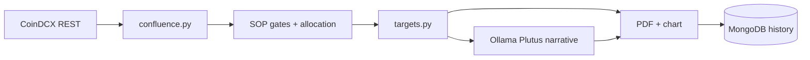

# CoinDCX Futures Advisor

CoinDCX futures signal research platform: SOP-gated advisor PDFs, a unified confluence engine, and optional Ollama (Plutus) narratives.

> **Disclaimer:** Education and research only — not financial advice. Trading digital assets involves substantial risk.

---

## What it does

1. Fetches live candles from CoinDCX (public API, no exchange key required)
2. Runs confluence pre-gates ([`src/planitt/confluence.py`](src/planitt/confluence.py))
3. Computes entry band, SL, TP, leverage in Python ([`src/advisor/targets.py`](src/advisor/targets.py))
4. Enforces SOP gates and weekly allocation caps
5. Optionally generates three narrative paragraphs via Ollama ([`config/prompts/advisor_narrative_system.md`](config/prompts/advisor_narrative_system.md))
6. Writes PDF + chart to `output/reports/`

---

## Architecture



---

## Quick start

```bash
cp .env.example .env
# Edit MONGODB_URI and PLANITT_PROCESSOR_INTERNAL_API_KEY

python3 -m venv .venv && source .venv/bin/activate
pip install -r requirements.txt

python scripts/run_server.py
```

- API docs: http://localhost:8000/api/docs
- Health: http://localhost:8000/health

### Generate one signal

```bash
export API_KEY="your-key"   # same as PLANITT_PROCESSOR_INTERNAL_API_KEY

curl -X POST "http://localhost:8000/api/v1/advisor/generate" \
  -H "Content-Type: application/json" \
  -H "x-api-key: $API_KEY" \
  -d '{"symbol": "BTC", "timeframe": "1h"}'
```

### One-shot scan (no server)

```bash
python scripts/run_advisor_scan.py
```

---

## Configuration

| Variable | Purpose |
|----------|---------|
| `MONGODB_URI` | Required — advisor history |
| `PLANITT_PROCESSOR_INTERNAL_API_KEY` | Protects `/api/v1/advisor/*` via `x-api-key` |
| `ENABLE_BACKGROUND_SCANNER` | Periodic universe scan |
| `SCAN_INTERVAL` | Seconds between scans (min 900 enforced) |
| `MAX_WEEKLY_SIGNALS` | Weekly cap |
| `ADVISOR_MIN_CONFIDENCE` | Minimum confluence confidence |
| `LLM_PROVIDER` | `ollama` (default), `openai`, or `anthropic` |
| `OLLAMA_MODEL` | Default `0xroyce/plutus` |
| `ENABLE_LLM_ANALYSIS` | LLM narrative on PDF (template fallback if off/unavailable) |
| `ADVISOR_LLM_SYSTEM_PROMPT_PATH` | Optional override for system prompt file |

See [`.env.example`](.env.example) and [`config/settings.py`](config/settings.py).

---

## Ollama setup

```bash
ollama pull 0xroyce/plutus
# Optional alias with embedded system prompt:
ollama create cryptotradeai -f ollama/Modelfile
```

Manual chat prompts (not used by the scanner): [docs/ADVISOR_LLM.md](docs/ADVISOR_LLM.md)

---

## Repository layout

```
config/           settings, constants, prompts/
src/advisor/      SOP pipeline, PDF generation
src/planitt/      Confluence engine, Mongo persistence helpers
src/data/         CoinDCX client and DataFetcher
src/indicators/   Technical indicator library
src/llm/          Ollama / OpenAI / Anthropic agents
src/reports/      PDF and chart rendering
src/api/          FastAPI server and routes
scripts/          run_server.py, run_advisor_scan.py
tests/            Advisor and confluence tests
```

---

## Testing

```bash
pip install -r requirements-dev.txt
pytest tests/test_advisor_sop_gates.py tests/test_advisor_allocation.py \
  tests/test_coindcx_client.py tests/test_advisor_pdf_smoke.py \
  tests/test_advisor_narrative.py -q
```

---

## Related docs

| Document | Purpose |
|----------|---------|
| [START_HERE.md](START_HERE.md) | 5-minute bootstrap |
| [docs/ADVISOR_LLM.md](docs/ADVISOR_LLM.md) | Manual LLM prompt templates |
| [TRADING_STRATEGIES.md](TRADING_STRATEGIES.md) | Strategy framework and risk models |

---

## License

MIT License (or your chosen license).
